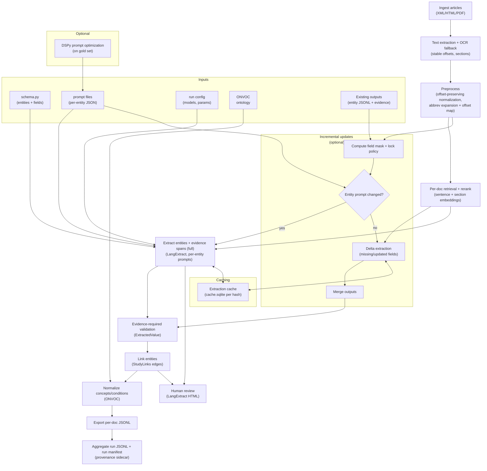
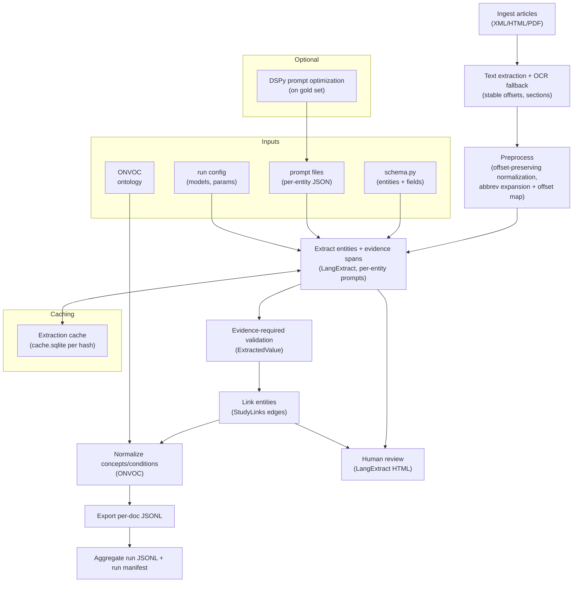

# Neuroimaging Article Information Extraction workflow

The goal is to create a workflow for extracting structured information from neuroimaging articles
with grounding evidence and verification.
Each article will have lists of entities (groups, tasks, modalities, contrasts/analyses).
Each of these entities will have information about them
with evidence from the text.
As well, these entities may be linked to each other
(e.g., a group performing a task with a certain modality and contrast).

## Workflow Steps

1. **Article Ingestion**: Load neuroimaging articles in various formats (PDF, HTML, etc.).

2. **Text Extraction**: Extract raw text from the articles using OCR or text parsing libraries. (likely using docling)

3. **Preprocessing**: Offset-preserving normalization and optional abbreviation expansion (spaCy) with an offset map.

4. **Extraction + Evidence Alignment**: Use LangExtract to identify and extract entities and their fields with aligned evidence spans.

5. **Entity Linking**: Link related entities together based on their relationships described in the text.

6. **Verification**: Implement a verification step to ensure the accuracy of extracted entities and their relationships, using evidence spans and LangExtract HTML review.

7. **Normalization**: Standardize entity names for consistency across articles (ONVOC).

8. **Output Generation**: Write per-document JSONL and aggregate into a run-level JSONL for analysis or storage.

## Workflow Diagram

## Critical Considerations

What is our schema going to look like?

## Random thoughts on implementation

For the schema, we will be tracking several entities:
- Groups
- Tasks
- Modalities
- Contrasts/Analyses

### Groups
Groups may be one implicit convienience sample; it could be just one person forming a group.

A paper may even include multiple datasets, each with
their own groups.

Or they may combine data from multiple sites.

There is also the possibility of groups being stratified
upon a continuous variable, like age, and there are no
strict categories.

### Tasks
Tasks may or may not be explicitly named in the text.
Tasks can be meta, like a switch task contains multiple
tasks within it. So a task could be hierarchical and
contain other tasks.

### Modalities
Modalities are likely to be a closed set of options,
like fMRI, DTI, EEG, MEG, PET, etc. that I am specifically interested in.

### Contrasts/Analyses
Contrasts and analyses may be more free-form text,
specifically relating to tasks/modalities/groups.
I would like to know outcome measures for the contrasts/analyses as well.

### Evidence
The document text that supports an extraction may have additional noisy formatting. LangExtract returns extractions with aligned evidence spans; summaries can be synthesized but must reference supporting spans.

### Individual Extraction Steps
The extracted information will need to be extracted in small groups of related entities,
and in an hierarchical manner at times. For example, I will extract all the group names,
then within each group, extract their sample sizes, ages, medical conditions, etc.
Linkages may be another step separately after all entities are filled out.
Prompt files will be stored per entity type (JSON) and can be optimized with DSPy.

### Passing in section context
When I'm looking for relevent text for an entity, I want the model to have
context on what section of the paper it is in, sometimes section titles explicitly label
the group being studied.

### Summary fields
Summaries will be stored in attributes while keeping the extraction_text verbatim, with evidence spans supporting the summary.

### Document IDs
Document IDs are derived from directory names (pmid-doi-pmcid), with missing IDs omitted.

### How to find relevant text for information extraction
If I'm grouping the the extractions for specific entities, I do not want to pass the entire document for each extraction, so I want to find relevant text spans to pass into the model, and re-relate the evidentiary text spans back to the full document.
If this step is messy (adding in extra text), then the extraction step will need to be
a better model to decide which sentences are actually relevant to answering the question.
If the sentences can be narrowly identified, then a smaller model can be used for the extraction step, which would be more cost effective. A large concern is that sentences may appear to be relevant, but refer to another entity. If I have two groups, controls, and patients, the demographic text for the patients may be selected when I'm looking for the controls demographics.

### Robust to changes in schema and document formats
We will be making changes to the schemas over time.
This will be reflected in the final schema, but in a more nuanced way,
the groupings and relationship/linking between entities may change, 
and the order of extraction may change, so I want to make sure that the workflow
is abstracted enough to handle these changes in a modular way.

### Be modular to multiple post-processing steps
After the initial extraction, there may be multiple post-processing steps
to normalize units, formatting, naming conventions, mapping to ontologies, etc.

### How to represent schemas
from the perspective of extraction, do the groupings make sense? Some of the fields are inference (not literally pulling from the text, like summarization or choosing from an ENUM), some are literally pulling from text, and some are doing a simple inference (whether something exists or not as a boolean).

There are three perspectives I can see:
1) the view from the data consumer to see the clean data output.

2) the view of grouping logically similar fields together

3) the view of submitting/extracting fields with the same model that are within the same "topic", like the group, some fields may be better extracted with different models.

### Preprocessing of the text

I would like to expand abbreviations before extraction.
This will make it easier for the model to find relevant text.
Abbreviation expansion will use spaCy and must preserve offsets.

### Post-processing graph representation

The final output may be best represented as a knowledge graph
about the paper, since groups, tasks, modalities can all be connected.
Per-document outputs will be named using pmid-doi-pmcid derived from input directory names.
