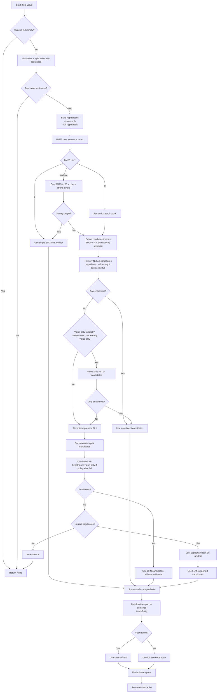

# extract_entities_gpt5_nano.py

Standalone GPT-5-nano extraction script that populates the study schema, links entities,
and grounds every extracted field to evidence spans in the source document.

## Quick start

```bash
source .venv/bin/activate
python scripts/extract_entities_gpt5_nano.py \
  --input-md outputs/text/20260112_221156/xTs9gzGeybhU/elsevier/15488423-10.1016_j.neuroimage.2004.06.041.md
```

## Outputs

For an input `paper.md`, the script produces:

- `paper.entities.gpt5-nano.json` (raw extraction)
- `paper.entities.gpt5-nano.grounded.json` (with evidence spans)
- `paper.entities.gpt5-nano.expanded.json` (abbreviation-expanded values when available)
- `paper.expanded.md` (abbreviation-expanded text when available)

If `paper.entities.gpt5-nano.json` already exists and is valid, extraction is skipped
unless you pass `--force-reextract`.

## Key flags

- `--input-md`: markdown input to extract
- `--output-json`: custom output path for grounded JSON
- `--skip-links`: skip entity linking
- `--force-reextract`: re-run extraction even if a prior JSON exists
- `--embedding-model`: sentence-transformers model for retrieval
- `--nli-model`: NLI model for evidence validation
- `--evidence-top-k`: max candidates for NLI per value sentence
- `--evidence-entailment-threshold`: entailment cutoff (default 0.6)
- `--evidence-device`: -1 for CPU, 0+ for CUDA
- `--cpu-threads`: set CPU thread counts for torch/BLAS

## Evidence grounding workflow




## Notes

- Evidence hypothesis templates and value-only policies live in `information_extraction/schema.py`
  under `extraction_meta(...)` fields.
- Abbreviation expansion uses `*.abbreviations.json` next to the input markdown.
- Evidence embeddings are cached in `.cache/evidence_embeddings`.

## feeback from "AI" computational linguist

Here’s a focused review of the grounding evidence workflow in extract_entities_gpt5_nano.py from a computational linguistics + software engineering lens.

Strengths

Layered retrieval (BM25 → semantic) keeps recall high while bounding cost; strong‑single BM25 is a good precision shortcut.
Value‑only hypothesis fallback is a pragmatic fix for free‑text fields; helps with synthesized values.
Combined‑premise fallback addresses multi‑sentence evidence (common in Methods).
Abbreviation expansion before embedding/NLI is a big win for biomedical text.
NLI gate with neutral‑only LLM fallback controls hallucination risk and cost.
Span mapping with fallback to full sentence preserves traceability.
Weaknesses / Fragilities

Hypothesis phrasing ("<value> is <field description>") can be semantically odd for method categories or contrasts; it pushes NLI toward neutral/contradiction.
Combined‑premise concatenation can introduce contradictions or dilute entailment; NLI models aren’t trained for multi‑premise concatenations.
Global thresholds (BM25, entailment) ignore field type and query length; short values tend to under‑score.
Single‑sentence evidence bias: high BM25 overlap can overpower better semantic candidates, and full‑sentence fallback can reuse irrelevant sentences.
Context label injection (e.g., analysis/task names) can make hypotheses longer and less “entailed” by short method sentences.
Tokenization/sentence splitting still brittle around citations/parentheticals despite abbreviation expansion.
Value‑only heuristic is hardcoded; many fields would be better handled by schema‑level metadata rather than a fixed list.
No confidence scoring beyond thresholds; it’s “pass/fail” without ranking or uncertainty reporting.
Improvements (highest leverage)

Field‑aware hypothesis templates
Use templates per field type (e.g., analysis_method: “The analysis used <value>.”) rather than “is <description>.” This should improve entailment on methodological sentences.

Field‑specific evidence policy
Store per‑field settings in schema metadata (value‑only, expected section, numeric/short‑string handling, NLI threshold). That avoids hardcoded lists.

Scored ranking instead of pass/fail
Combine BM25 + semantic similarity + NLI score into a composite rank. Use thresholds only for final selection; still keep “top‑1” if it dominates.

Multi‑premise entailment without concatenation
For combined evidence, run NLI per sentence and select a minimal supporting subset (e.g., greedy set cover) rather than concatenating.

Context label gating
Only include context label when it’s short and likely to be mentioned (“cohort FTLD”), or add it as a soft feature rather than in hypothesis text.

Evidence diversity control
Penalize reusing the same sentence across unrelated fields unless it’s a perfect match; otherwise pick the next best candidate.

Section priors
Prefer Methods/Results for analysis_method and design_details, and only backfill from Discussion if nothing else passes.

If you want, I can implement #1 + #2 (template + per‑field policy) first; that should reduce the “SPM99 sentence doesn’t entail the hypothesis” failures without inflating false positives.

(I implemented #1 and #2 in the latest commit.)
